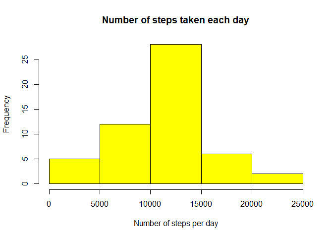

### --------------------------------------------------------------------------------
### Author : Shini Renjith
### Date : 09 May 2020
### --------------------------------------------------------------------------------

## 1. Loading and preprocessing the data

### 1.1. Load the data (i.e. read.csv())


```r
# Extract from zip file
if (!file.exists("activity.csv") ){
	unzip("activity.zip")
	print("activity.csv is extracted to local directory")
} else {
	print("activity.csv already exists in local directory")
}
```

```
## [1] "activity.csv already exists in local directory"
```

```r
# Read data from csv
raw_data <- read.csv("activity.csv", header = TRUE)
dim(raw_data)
```

```
## [1] 17568     3
```

```r
head(raw_data)
```

```
##   steps       date interval
## 1    NA 2012-10-01        0
## 2    NA 2012-10-01        5
## 3    NA 2012-10-01       10
## 4    NA 2012-10-01       15
## 5    NA 2012-10-01       20
## 6    NA 2012-10-01       25
```

### 1.2. Process/transform the data (if necessary) into a format suitable for your


```r
# Ignore NA values
clean_data <- na.omit(raw_data)
dim(clean_data)
```

```
## [1] 15264     3
```

```r
head(clean_data)
```

```
##     steps       date interval
## 289     0 2012-10-02        0
## 290     0 2012-10-02        5
## 291     0 2012-10-02       10
## 292     0 2012-10-02       15
## 293     0 2012-10-02       20
## 294     0 2012-10-02       25
```

## 2. What is mean total number of steps taken per day?

### 2.1. Make a histogram of the total number of steps taken each day


```r
# Load "dplyr" package
library(dplyr)
```

```
## 
## Attaching package: 'dplyr'
```

```
## The following objects are masked from 'package:stats':
## 
##     filter, lag
```

```
## The following objects are masked from 'package:base':
## 
##     intersect, setdiff, setequal, union
```

```r
# Get steps per day using aggregate() function
daily_steps <- aggregate(steps ~ date, clean_data, sum)

# Plot histogram of the total number of steps taken each day
hist(daily_steps$steps,
	 col = "yellow",
	 main = "Number of steps taken each day",
	 xlab = "Number of steps per day")
```

<!-- -->

### 2.2. Calculate and report the mean and median total number of steps taken per day


```r
# Calculate the mean of the total number of steps per day
mean_steps <- mean(daily_steps$steps)
print (mean_steps)
```

```
## [1] 10766.19
```

```r
# Calculate the median of the total number of steps per day
median_steps <- median(daily_steps$steps)
print (median_steps)
```

```
## [1] 10765
```

## 3. What is the average daily activity pattern?

### 3.1. Make a time series plot (i.e. type = "l") of the 5-minute interval (x-axis) and the average number of steps taken, averaged across all days (y-axis)


```r
# Get average steps y interval across all days
average_steps_by_interval <- aggregate(steps ~ interval, clean_data, mean)

# Make a time series plot (i.e. type = "l")
plot(average_steps_by_interval$interval,
	 round(average_steps_by_interval$steps,0),
	 type = "l", 
	 main = "Average daily activity pattern", 
	 ylab = "Avarage number of steps taken", 
	 xlab = "5-min intervals")
```

<!-- -->

### 3.2. Which 5-minute interval, on average across all the days in the dataset, contains the maximum number of steps?


```r
# Get the interval with the maximum number of steps
max_average_steps <- which.max(average_steps_by_interval$steps)
max_interval <- average_steps_by_interval[max_average_steps,1]
print(max_interval)
```

```
## [1] 835
```

## 4. Imputing missing values

There are a number of days/intervals where there are missing values (coded as NA). The presence of missing days may introduce bias into some calculations or summaries of the data. So the following steps are performed

### 4.1. Calculate and report the total number of missing values in the dataset (i.e. the total number of rows with NAs)


```r
# Calculate and report the total number of missing values in the dataset
count_of_NA <- length(which(is.na(raw_data$steps)))
print(count_of_NA)
```

```
## [1] 2304
```

### 4.2. Devise a strategy for filling in all of the missing values in the dataset. The strategy does not need to be sophisticated. For example, you could use the mean/median for that day, or the mean for that 5-minute interval, etc.

- Decided to replace NA values with the mean value
- impute() function from "Hmisc" package is used to achive the same


```r
# Load "Hmisc" package
library("Hmisc")
```

```
## Warning: package 'Hmisc' was built under R version 3.6.3
```

```
## Loading required package: lattice
```

```
## Loading required package: survival
```

```
## Warning: package 'survival' was built under R version 3.6.3
```

```
## Loading required package: Formula
```

```
## Loading required package: ggplot2
```

```
## Registered S3 methods overwritten by 'ggplot2':
##   method         from 
##   [.quosures     rlang
##   c.quosures     rlang
##   print.quosures rlang
```

```
## 
## Attaching package: 'Hmisc'
```

```
## The following objects are masked from 'package:dplyr':
## 
##     src, summarize
```

```
## The following objects are masked from 'package:base':
## 
##     format.pval, units
```

### 4.3. Create a new dataset that is equal to the original dataset but with the missing data filled in.


```r
# Create a new dataset that is equal to the original dataset but with the missing data filled in
impute_data <- raw_data
impute_data$steps <- impute(raw_data$steps, fun=mean)
dim(impute_data)
```

```
## [1] 17568     3
```

```r
head(impute_data)
```

```
##     steps       date interval
## 1 37.3826 2012-10-01        0
## 2 37.3826 2012-10-01        5
## 3 37.3826 2012-10-01       10
## 4 37.3826 2012-10-01       15
## 5 37.3826 2012-10-01       20
## 6 37.3826 2012-10-01       25
```

### 4.4.a. Make a histogram of the total number of steps taken each day


```r
# Get steps per day using aggregate() function with new data
daily_steps_NA_replaced <- aggregate(steps ~ date, impute_data, sum)

# Plot histogram of the total number of steps taken each day
hist(daily_steps_NA_replaced$steps,
	 col = "green",
	 main = "Number of steps taken each day",
	 xlab = "Number of steps per day")
```

<!-- -->

### 4.4.b.Calculate and report the mean and median total number of steps taken per day


```r
# Calculate the mean of the total number of steps per day
mean_steps_NA_replaced <- mean(daily_steps_NA_replaced$steps)
print (mean_steps_NA_replaced)
```

```
## [1] 10766.19
```

```r
# Calculate the median of the total number of steps per day
median_steps_NA_replaced <- median(daily_steps_NA_replaced$steps)
print (median_steps_NA_replaced)
```

```
## [1] 10766.19
```
### 4.4.c. Do these values differ from the estimates from the first part of the assignment?


```r
# Compare the mean and median of both scenarios (removing and imputing NA values)
NA_ignored <- c(mean_steps,median_steps)
NA_replaced <- c(mean_steps_NA_replaced,median_steps_NA_replaced)
comparison <- cbind(NA_ignored,NA_replaced)
row.names(comparison) <- c("mean","median")
print(comparison)
```

```
##        NA_ignored NA_replaced
## mean     10766.19    10766.19
## median   10765.00    10766.19
```

### 4.4.d. What is the impact of imputing missing data on the estimates of the total daily number of steps?

- The mean value after imputing is same as that of removing NA values
- The new median has become equal to the mean and has slight variation from the old value
- This behaviour is caused as we used the overall mean value for imputing NA values

## 5. Are there differences in activity patterns between weekdays and weekends?

Additional input provided: For this part the weekdays() function may be of some help here. Use the dataset
with the filled-in missing values for this part.

### 5.1. Create a new factor variable in the dataset with two levels - "weekday" and "weekend" indicating whether a given date is a weekday or weekend day.


```r
# Creating new factor variable in the dataset with two levels - "weekday" and "weekend"
impute_data$date <- as.Date(impute_data$date)
impute_data$daytype <- ifelse(weekdays(impute_data$date) == "Saturday" 
									   | weekdays(impute_data$date) == "Sunday",
									   "weekend", "weekday")

# Verifying the new factor variable
str(impute_data)
```

```
## 'data.frame':	17568 obs. of  4 variables:
##  $ steps   : 'impute' num  37.4 37.4 37.4 37.4 37.4 ...
##   ..- attr(*, "imputed")= int  1 2 3 4 5 6 7 8 9 10 ...
##  $ date    : Date, format: "2012-10-01" "2012-10-01" ...
##  $ interval: int  0 5 10 15 20 25 30 35 40 45 ...
##  $ daytype : chr  "weekday" "weekday" "weekday" "weekday" ...
```

```r
table(impute_data$daytype)
```

```
## 
## weekday weekend 
##   12960    4608
```

### 5.2. Make a panel plot containing a time series plot (i.e. type = "l") of the 5-minute interval (x-axis) and the average number of steps taken, averaged across all weekday days or weekend days (y-axis). 


```r
# Load "ggplot2" package
library(ggplot2)

# Calculate the mean of the total number of steps per type of the day ("weekday" or "weekend")
average_steps_by_daytype <- aggregate(steps ~ interval + daytype, data = impute_data, mean)

ggplot(average_steps_by_daytype, aes(x=interval, y=steps, color=6)) + 
        geom_line() + 
        facet_grid(daytype ~ .) +
		theme_bw() +
		theme(legend.position = "none") +
        xlab("Interval") + 
        ylab("Number of steps") +
        ggtitle("Weekdays and weekends activity patterns")
```

<!-- -->

Observation : The number of steps on weekends are higher on average during the day, but the peak in the morning is higher on weekdays.
